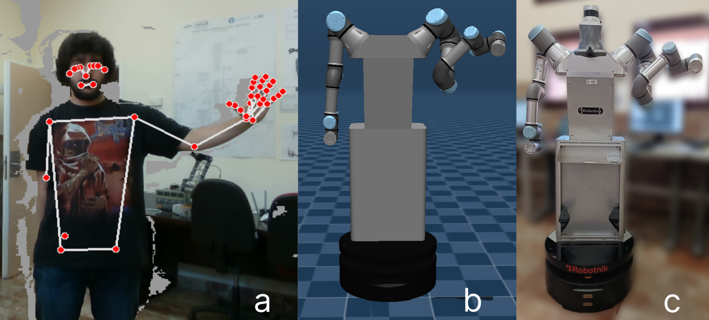
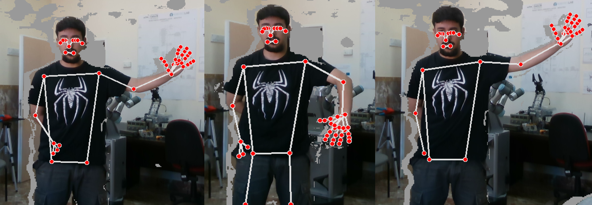
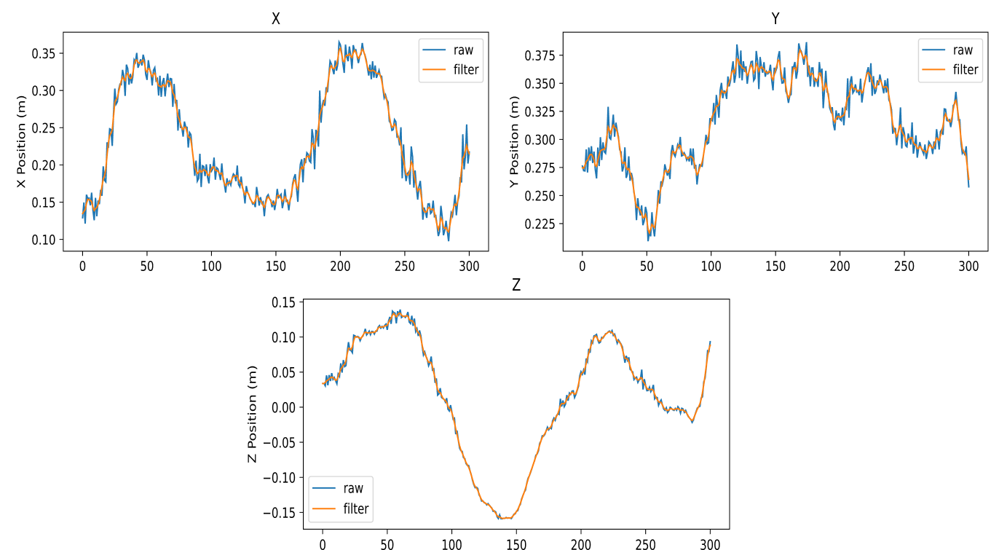

# **TAICHI (Tracking Algorithm for Imitation of Complex Human Inputs)**
<p align="center">
  
</p>

This project presents the TAICHI algorithm. This algorithm is focused on the tracking of people to collect data for the Imitation Learning technique. TAICHI is composed of a detection of the significant points of the human arm and its extraction and mapping to the robot, a Gaussian filtering process to smooth the movements and filter the sensor noise and an optimization algorithm that seeks to obtain through the inverse kinematics of the model the configuration that is closest to the human one and that does not generate collisions with its environment or with itself.

# Installation
To be used on your device, follow the installation steps below.

**Requierements:**
- Python 3.10.0 or higher

> **Note**: The Adam Simulator works on Linux, Windows and Mac.

## Install miniconda (highly-recommended)
It is highly recommended to install all the dependencies on a new virtual environment. For more information check the conda documentation for [installation](https://conda.io/projects/conda/en/latest/user-guide/install/index.html) and [environment management](https://conda.io/projects/conda/en/latest/user-guide/tasks/manage-environments.html). For creating the environment use the following commands on the terminal.

```bash
conda create -n taichi python=3.10.0 numpy=1.24.2
conda activate taichi
```
> **Note**: It is import to use numpy version 1.24.2 to dont have problems in the Matlab execution (versions higher than 1.25 have Warnings in the data processing from Python to Matlab).
## Install from source
Firstly, clone the repository in your system.
```bash
git clone https://github.com/AdrianPrados/TAICHI.git
```

Then, enter the directory and install the required dependencies
```bash
cd TAICHI
pip install -r requirements.txt
```

# Usage
To use the TAICHI algorithm directly on the model of the robot and robotic arm presented in the paper, it is necessary to have both [MATLAB (R2022a)](https://es.mathworks.com/products/new_products/release2022a.html) and the [MujoCo](https://github.com/openai/mujoco-py) simulator installed. The simulator used in this work has been developed by our laboratory and all the information can be found in [ADAM Simulator](https://github.com/vistormu/adam_simulator). The algorithm has been tested and uses the specific packages for the [RealSense D435i](https://www.intelrealsense.com/depth-camera-d435i/) camera. Feel free to use our algorithm to applied it in other models and robotic arms.

The code is divided in two files:

`MatlabCode` stores all the files to apply the algorithm directly in Matlab.

`PythonCode` stores all the files to apply the algorithm directly in Python.

### **MatlabCode**
*Matlab Requierements:*
- Robotics System Toolbox
- Phased Array System Toolbox

The code available in **MatlabCode** contains:

`bodyx.stl` allows to load the full model of the ADAM robot in different body parts.

`HumanLikeArm.m` allows to run the full process once the data has been acquired.

`IK_UR.m` allows calculate the Analytical Inverse Kinematics (AIK) for different UR models such as UR3, UR5 and UR10.

If you want to use different UR model, in `IK_UR.m` modify the variables for the line:

```matlab
res = double(pyrunfile("UR3_Inverse_Kinematics.py","Sol",M = npM,name = name,launcher = launcher));
```
where `name` can be `ur3`, `ur5` or `ur10` and `launcher` can be `matlab` or `python`. The previous line calls `UR3_Inverse_Kinematics.py` that obtain the AIK values.

`distanceMetric.m` function to evaluate the distance between the human elbow and the rest of the robotic joints.

`distOrientation` function to evaluate the orientation of the end effector.

`distPosition` function to evaluate the position of the end effector.

`variationWrist` function to evaluate the wrist variation between the previous state and the actual state.

`PlotError.m` function to plot the error for the end-effector respect the human wrist.

To use the **MatlabCode** just run the `HumanLikeArm.m` script modifying the values of the path were the data is stored.

```matlab
path = '/your_directory/HumanLikeCode/HumanData/PruebaX/DatosBrazoHumano.csv';
path2 = '/your_directory/HumanLikeCode/HumanData/PruebaX/CodoHumano.csv';
```
### **PythonCode**
The code available in **PythonCode** contains:

`HumanLikeArm.py` works exactly the same as the MatlabCode one but all in Python.

`UR3_Inverse_Kinematics.py` allows to obtains the AIK solutions. The script return 8 solution for each point taking into account the limits for each arm.

`brazoProf.py` acquired the data from the camera an save it in the path specified. Must be the same that you use in `HumanLikeArm.py` and 
`HumanLikeArm.m`.

To use the **PythonCode** just run the `HumanLikeArm.py` script modifying the values of the path were the data is stored.

``` bash
cd Taichi/PythonCode
python HumanLikeArm.py
```

### **Data Acquisition**
The acquisition of the data can be only done using Python. For that purpose, you have to run the `brazoProf.py`:

``` bash
cd Taichi/PythonCode
python brazoProf.py
```
This will open a window that show the user moving with the MediaPipe lines for the Pose estimation and Hand Tracking.

<p align="center">
  
</p>

Once the data as been acquired, pushing `q` or `esc` allows to stop the data acquisition. After that and previously to the storage of the data, a Gaussian Filter is applied. The filtered can be seen for wrist and elbow position and wrist orientation using:

``` python
plot_smoothed_EndEfector(DATOSPRE,XEnd,YEnd,ZEnd)
plot_smoothed_Elbow(CORCODOPRE,XElbow,YElbow,ZElbow)
plot_smoothed_rotations(DATOSPRE,R1,R2,R3,R4,R5,R6,R7,R8,R9)
```

<p align="center">
  
</p>

> **Note**: At the moment, the algorithm only works for the left arm. To obtain correct data, the right arm must be hide.

# Citation
If you use this code, please quote our work :blush:

In construction :construction_worker:
